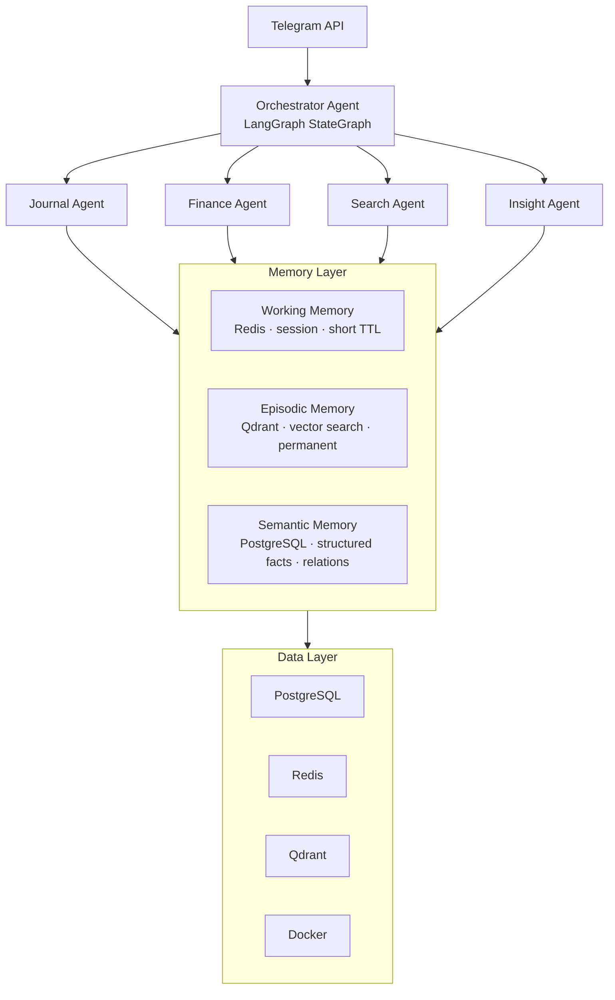

# CLAUDE.md — Telegram Second Brain Bot

> This file defines the architecture, conventions, and project context for Claude Code.
> Update this file whenever a significant architectural decision changes.

---

## Project Overview

A multi-functional Telegram bot with a long-term memory system (second brain) powered by specialized agents. The goal is for the bot to **proactively understand the user over time** rather than just answering isolated questions.

**Core features (phase 1):**
- Journaling + emotion analysis
- Expense tracking + behavioral pattern recognition
- Web search with summarization
- Long-term personal trend analysis

---

## System Architecture



---

## Project Structure

Architecture pattern: **Vertical Slice** — each feature module is a self-contained slice. Modules never import from each other; they only depend on `core/` (contracts) and `infra/` (shared services).

```
.
├── CLAUDE.md                        # This file
├── docker-compose.yml               # Full infra: app + qdrant + postgres + redis
├── .env.example                     # Env variable template (NEVER commit real .env)
├── pyproject.toml                   # Dependency management (uv or poetry)
│
├── app/
│   ├── main.py                      # Entry point — wires everything together
│   │
│   ├── core/                        # Contracts only — no implementations here
│   │   ├── base_agent.py            # BaseAgent ABC — all agents implement this
│   │   ├── base_memory.py           # BaseMemory ABC — all memory backends implement this
│   │   ├── base_tool.py             # BaseTool ABC — all tools implement this
│   │   └── state.py                 # AgentState TypedDict — shared across all agents
│   │
│   ├── modules/                     # Feature modules — vertical slices
│   │   │                            # Rule: modules NEVER import from each other
│   │   ├── journal/                 # Self-contained journaling feature
│   │   │   ├── __init__.py
│   │   │   ├── agent.py             # Implements BaseAgent
│   │   │   ├── schemas.py           # Pydantic models for this module only
│   │   │   ├── tools.py             # Tools specific to journal (emotion analysis, etc.)
│   │   │   └── prompts.py           # Prompt templates for journal agent
│   │   │
│   │   ├── finance/                 # Self-contained expense tracking feature
│   │   │   ├── __init__.py
│   │   │   ├── agent.py             # Implements BaseAgent
│   │   │   ├── schemas.py           # Expense, Category, Summary models
│   │   │   ├── tools.py             # Tools specific to finance (categorizer, parser)
│   │   │   └── prompts.py           # Prompt templates for finance agent
│   │   │
│   │   ├── search/                  # Self-contained web search feature
│   │   │   ├── __init__.py
│   │   │   ├── agent.py             # Implements BaseAgent
│   │   │   ├── schemas.py           # SearchResult, Summary models
│   │   │   ├── tools.py             # Web search + URL parser tools
│   │   │   └── prompts.py           # Prompt templates for search agent
│   │   │
│   │   └── insight/                 # Self-contained long-term analysis feature
│   │       ├── __init__.py
│   │       ├── agent.py             # Implements BaseAgent
│   │       ├── schemas.py           # InsightReport, Pattern, Trend models
│   │       ├── tools.py             # Memory query tools, pattern detector
│   │       └── prompts.py           # Prompt templates for insight agent
│   │
│   ├── orchestrator/                # Wires modules together — knows all modules
│   │   ├── graph.py                 # LangGraph StateGraph — main routing graph
│   │   ├── router.py                # Intent classification — decides which module runs
│   │   └── registry.py             # Module registry — register/discover agents
│   │
│   ├── infra/                       # Shared infrastructure — no module logic here
│   │   │                            # Rule: infra NEVER imports from modules/
│   │   ├── memory/
│   │   │   ├── working.py           # Implements BaseMemory → Redis (short TTL)
│   │   │   ├── episodic.py          # Implements BaseMemory → Qdrant (permanent)
│   │   │   ├── semantic.py          # Implements BaseMemory → PostgreSQL (facts)
│   │   │   └── ingestion.py         # Pipeline: clean → chunk → embed → index
│   │   │
│   │   ├── providers/
│   │   │   ├── base.py              # BaseLLMProvider ABC
│   │   │   ├── registry.py          # Provider registry — loaded from config
│   │   │   ├── embedder.py          # Embedding wrapper — swappable model
│   │   │   └── README.md            # Guide for adding new providers
│   │   │
│   │   └── db/
│   │       ├── models.py            # SQLAlchemy models (shared tables only)
│   │       ├── session.py           # Async session factory
│   │       └── migrations/          # Alembic migration files
│   │
│   ├── bot/                         # Telegram interface layer
│   │   ├── handlers.py              # Message handlers — delegates to orchestrator
│   │   ├── middlewares.py           # Auth, rate limiting, user context injection
│   │   ├── keyboards.py             # Inline keyboard helpers
│   │   └── scheduler.py            # APScheduler — proactive notifications
│   │
│   ├── config/
│   │   ├── settings.py              # pydantic-settings — validates all env vars
│   │   └── logging.py               # Structured JSON logging setup
│   │
│   └── utils/
│       ├── chunker.py               # Semantic chunking — shared utility
│       ├── logger.py                # Logger factory
│       └── helpers.py               # Pure functions with no side effects
│
├── tests/
│   ├── unit/
│   │   ├── modules/                 # Each module tested in isolation
│   │   │   ├── test_journal.py
│   │   │   ├── test_finance.py
│   │   │   ├── test_search.py
│   │   │   └── test_insight.py
│   │   ├── infra/
│   │   │   ├── test_memory.py
│   │   │   └── test_providers.py
│   │   └── orchestrator/
│   │       └── test_router.py
│   ├── integration/                 # Tests that hit real DB / Qdrant
│   └── conftest.py
│
└── scripts/
    ├── seed_db.py                   # Seed data for dev environment
    └── reindex.py                   # Re-embed all memories when switching model
```

### Dependency rules (strictly enforced)

```
modules/  →  core/       ✅  implement interfaces
modules/  →  infra/      ✅  use shared services
modules/  →  modules/    ❌  never cross-import between feature modules
infra/    →  core/       ✅  implement interfaces
infra/    →  modules/    ❌  infra must not know modules exist
bot/      →  orchestrator/ ✅  bot only talks to orchestrator
orchestrator/ → modules/ ✅  only place that knows all modules
```

### Adding a new module (checklist)

1. Create `app/modules/<name>/` with `agent.py`, `schemas.py`, `tools.py`, `prompts.py`
2. `agent.py` must subclass `BaseAgent` from `core/base_agent.py`
3. Register the agent in `orchestrator/registry.py`
4. Add routing condition in `orchestrator/router.py`
5. Write unit tests in `tests/unit/modules/test_<name>.py`
6. **Do not import from any other module** — use `infra/` for shared services only

---

## Tech Stack

| Layer | Technology | Reason |
|---|---|---|
| Bot framework | `aiogram 3.x` | Async-native, production-ready |
| Agent framework | `langgraph` | StateGraph suits complex multi-step flows with cycles |
| LLM abstraction | Custom provider interface | Flexibility to swap providers later |
| Embedding | `multilingual-e5-large` (default) | Good multilingual support |
| Vector DB | `Qdrant` (Docker) | Self-hosted, performant, rich payload filtering |
| Relational DB | `PostgreSQL 16` | Structured data, Alembic migrations |
| Cache / Session | `Redis 7` | Working memory, rate limiting |
| ORM | `SQLAlchemy 2.x` async | Type-safe, async support |
| Settings | `pydantic-settings` | Validates env vars at startup |
| Scheduler | `APScheduler` | Proactive scheduled notifications |
| Containerization | `Docker + Docker Compose` | Entire infra runs consistently on local and VPS |

---

## LLM Provider — Custom Interface

The provider will be defined later. All agents **must** use the abstract interface — never import a vendor SDK directly inside agent code.

```python
# app/providers/base.py
from abc import ABC, abstractmethod
from typing import AsyncIterator

class BaseLLMProvider(ABC):

    @abstractmethod
    async def complete(
        self,
        messages: list[dict],
        *,
        temperature: float = 0.7,
        max_tokens: int = 1000,
        stream: bool = False,
    ) -> str | AsyncIterator[str]:
        ...

    @abstractmethod
    async def embed(self, texts: list[str]) -> list[list[float]]:
        ...

    @property
    @abstractmethod
    def model_name(self) -> str:
        ...
```

To add a new provider: create `app/providers/<name>.py`, subclass `BaseLLMProvider`, register it in `registry.py`. Do not modify agent code.

---

## Memory Layer — Conventions

### Chunking
- **Never** chunk by fixed character count
- Use semantic chunking: split by idea, paragraph, or meaningful line break
- Target chunk size: 200–400 tokens with 50-token overlap

### Required metadata for every Qdrant point

```python
{
    "user_id": str,              # namespace isolation between users
    "source_type": str,          # "journal" | "finance" | "chat" | "url" | "file"
    "timestamp": int,            # Unix timestamp at creation time
    "importance": float,         # 0.0 – 1.0, decays over time
    "mood_score": float | None,  # only for journal entries
    "topics": list[str],         # semantic tags
    "language": str,             # "vi" | "en"
}
```

### Retrieval strategy
- **Hybrid search**: dense (vector cosine) + sparse (BM25) weighted 0.7 / 0.3
- Always filter by `user_id` before searching — never leak data across users
- Re-rank top-20 results using a cross-encoder before assembling the context window

### Memory decay
- `importance` decreases by 10% every 30 days if the chunk is not retrieved
- Weekly scheduler job compresses chunks with `importance < 0.2` into summaries

---

## Docker Compose — Infrastructure

```yaml
# docker-compose.yml (skeleton)
services:
  app:
    build: .
    env_file: .env
    depends_on: [postgres, redis, qdrant]
    restart: unless-stopped

  postgres:
    image: postgres:16-alpine
    volumes:
      - postgres_data:/var/lib/postgresql/data
    environment:
      POSTGRES_DB: secondbrain
      POSTGRES_USER: ${POSTGRES_USER}
      POSTGRES_PASSWORD: ${POSTGRES_PASSWORD}

  redis:
    image: redis:7-alpine
    command: redis-server --requirepass ${REDIS_PASSWORD}
    volumes:
      - redis_data:/data

  qdrant:
    image: qdrant/qdrant:latest
    volumes:
      - qdrant_data:/qdrant/storage
    environment:
      QDRANT__SERVICE__API_KEY: ${QDRANT_API_KEY}

volumes:
  postgres_data:
  redis_data:
  qdrant_data:
```

---

## Environment Variables (.env.example)

```env
# Telegram
TELEGRAM_BOT_TOKEN=

# LLM Provider (fill in after provider is decided)
LLM_PROVIDER=         # name registered in provider registry
LLM_API_KEY=
LLM_MODEL=
LLM_BASE_URL=         # if using a custom endpoint

# Embedding
EMBEDDING_MODEL=multilingual-e5-large
EMBEDDING_DEVICE=cpu  # or cuda if GPU is available

# PostgreSQL
POSTGRES_USER=
POSTGRES_PASSWORD=
POSTGRES_HOST=postgres
POSTGRES_PORT=5432
POSTGRES_DB=secondbrain

# Redis
REDIS_HOST=redis
REDIS_PORT=6379
REDIS_PASSWORD=
REDIS_TTL_SESSION=14400   # 4 hours working memory TTL

# Qdrant
QDRANT_HOST=qdrant
QDRANT_PORT=6333
QDRANT_API_KEY=
QDRANT_COLLECTION=secondbrain

# App
LOG_LEVEL=INFO
ENVIRONMENT=development  # development | production
```

---

## Code Conventions

### Required
- **Fully async**: all I/O (DB, HTTP, Telegram) must use `async/await`
- **Type hints**: every function must have complete type annotations
- **Pydantic models**: use for all data structures going in/out of agents
- **Structured logging**: use the `logger.py` wrapper, JSON format, never use `print()`
- **Error handling**: agents must never crash the bot — wrap with try/except and fall back to a user-friendly error message

### Naming
- Files: `snake_case.py`
- Classes: `PascalCase`
- Functions / variables: `snake_case`
- Constants: `UPPER_SNAKE_CASE`
- Agent state keys: `snake_case`, prefixed by agent name (`journal_`, `finance_`, ...)

### Agent state (LangGraph)
All agents receive and return a shared `AgentState` TypedDict:

```python
from typing import TypedDict, Annotated
from langgraph.graph.message import add_messages

class AgentState(TypedDict):
    messages: Annotated[list, add_messages]
    user_id: str
    intent: str                    # which agent was invoked
    retrieved_memories: list[dict] # context retrieved from Qdrant
    metadata: dict                 # auxiliary information
```

---

## Adding a New Agent (Module)

1. Create `app/modules/<name>/` with four files: `agent.py`, `schemas.py`, `tools.py`, `prompts.py`
2. In `agent.py` — subclass `BaseAgent` from `core/base_agent.py`, implement `async def run(state: AgentState) -> AgentState`
3. In `schemas.py` — define all Pydantic models this module needs (no sharing with other modules)
4. In `tools.py` — implement tools specific to this module only; shared tools go in `infra/`
5. Register in `orchestrator/registry.py` and add routing condition in `orchestrator/router.py`
6. Write tests in `tests/unit/modules/test_<name>.py`
7. **Never import from another module** — if you need shared logic, it belongs in `infra/` or `utils/`

---

## Adding a New Provider

1. Create `app/providers/<name>.py`, subclass `BaseLLMProvider`
2. Implement `complete()`, `embed()`, and `model_name`
3. Register in `app/providers/registry.py`
4. Add required env vars to `.env.example`
5. Write tests at `tests/unit/providers/test_<name>.py`

---

## First-Run Checklist

- [ ] Copy `.env.example` → `.env` and fill in all variables
- [ ] `docker compose up -d postgres redis qdrant` — wait until all services are healthy
- [ ] `python scripts/seed_db.py` — create schema and Qdrant collection
- [ ] `docker compose up app`
- [ ] Test the bot on Telegram with `/start`

---

## Architectural Decisions

| # | Decision | Reason |
|---|---|---|
| 1 | LangGraph over plain LangChain chains | StateGraph better handles multi-agent flows with cycles |
| 2 | Qdrant self-hosted via Docker | Full data control, no dependency on cloud vendors |
| 3 | Three separate memory layers | Each layer has different TTL and query patterns |
| 4 | Custom LLM provider interface | LLM not yet decided — avoids vendor lock-in from day one |
| 5 | Hybrid search (dense + sparse) | BM25 improves keyword-level precision, especially for non-English text |
| 6 | Semantic chunking | Journal and emotion data does not suit fixed-size splitting |

---

## Development Roadmap

- **Phase 1**: Journal Agent + Finance Agent + basic memory pipeline
- **Phase 2**: Search Agent + Insight Agent + proactive Scheduler
- **Phase 3**: Multi-user scaling, privacy hardening, advanced re-ranking

> LLM provider will be finalized after multilingual benchmarking.

> Last updated: project initialization